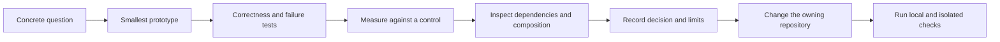

# Contributing

RustClamp is the ecosystem; Clamp is the application composition layer. The
facade now implements the Pico closure entrypoint in `examples/00-pico/`; the
base facade/Core/Kernel/Runtime closure remains small, while optional
integrations add only their selected ecosystem dependencies.

## Decision and Change Flow



Use this flow to decide whether a concept belongs in Core, Kernel, Runtime, an
integration, or application code. A benchmark without a correctness control, or
a design without a failure case, is incomplete evidence.

## Checkout and checks

Prerequisites: Git, rustup, Python 3.11 or newer, and Rust 1.96.1 with rustfmt and
Clippy. The pinned compiler is also the initial tested MSRV; older compilers are
not currently claimed. Edition 2024 and resolver 3 work on this toolchain.

```sh
mkdir clamp-dev
cd clamp-dev
git clone https://github.com/rustclamp/rustclamp.git
git clone https://github.com/rustclamp/core.git
git clone https://github.com/rustclamp/kernel.git
git clone https://github.com/rustclamp/runtime.git
git clone https://github.com/rustclamp/http.git
git clone https://github.com/rustclamp/postgres.git
git clone https://github.com/rustclamp/messaging.git
git clone https://github.com/rustclamp/worker.git
rustup toolchain install 1.96.1 --profile minimal --component clippy --component rustfmt
python3 rustclamp/tools/workspace.py
cargo metadata --offline --format-version 1
python3 rustclamp/tools/check.py
```

For immediate terminal verdicts on the common run, use:

```sh
python3 rustclamp/tools/run.py test
python3 rustclamp/tools/run.py bench
```

The runner marks passing suites and measured benchmark paths green with `✓`,
failures red with `✗`, and advisory benchmark or compiler caveats yellow with
`⚠`. Every benchmark result is followed by its intent in plain language. Each
run ends with an explicit success, warning, or failure summary. Color is
automatic for terminals, disabled for redirected output and `NO_COLOR`, and can
be forced with `--color always`. The benchmark is advisory on an uncontrolled
host; its warning does not mean the command failed.

`workspace.py` creates the root **virtual Cargo manifest**, never a root Git
repository. The package siblings remain independently owned, versioned repositories.
It refuses to overwrite a differing coordination manifest or toolchain file.
`workspace/` holds local coordination notes; `experiments/` holds architectural
experiments; `playground/` holds disposable apps. Their contents are local.
The reproducible coordination source lives in this repository's `tools/`.

The full check verifies workspace membership, boundaries, formatting, Clippy,
tests and rustdoc, then copies each package and its declared internal dependency
closure into a temporary directory. It builds a consumer using versioned relative
paths. For packages with unpublished internal dependencies, it checks the package
file list; full archive verification waits until dependencies exist in the registry.
Python powers the dependency harness; it adds no Rust package dependency.

For a single repository, clone it outside the ecosystem workspace and run the
commands in its README. Each package has its own manifest, toolchain and lockfile.
No package inherits Cargo settings from the generated root manifest. Workflow
files are in the local source but cannot be uploaded with the current GitHub token;
the pushed source snapshot omits them.
The root lockfile is local coordination state; package lockfiles are committed.
Once published, the combined and independent workflows will run the actual Cargo
test targets. Combined CI will test the current repository revision against the
other repositories' `main` branches; coordinated breaking changes require checking
out matching revisions locally before merging. Each remote began with a README-only
commit followed by a source snapshot. Detailed local development commits remain
in the original local histories.

## Dependency and code policy

- Keep all four packages dependency-free until an implemented prototype needs an
  edge. Do not add re-exports or placeholder traits merely to connect the graph.
- Allowed future directions: facade to Core/Kernel/Runtime, Kernel to Core, and
  Runtime to Core. Every other dependency requires an ADR and a boundary-policy
  update. This initial rule also covers dev/build, optional, renamed and
  target-specific dependencies and the resolved transitive closure.
- For a justified sibling edge, use both a compatible version and relative path,
  for example `rustclamp-core = { version = "0.1", path = "../core" }`.
  Published manifests resolve the version through the registry. Never embed a
  developer's absolute path. Extend isolated checkout tooling when such edges
  first exist; before dependencies are published, include their coordinated source
  checkout rather than claiming registry-only reproducibility.
- Format with rustfmt. Clippy and rustdoc warnings fail CI. Document every public
  item and keep intra-doc links valid. Unsafe code is forbidden in these packages.
  Any future platform boundary that needs unsafe requires a separately reviewed
  decision and focused safety tests.
- The standalone allocation measurement tool has a narrow unsafe adapter described
  in ADR 0003. Its format, Clippy and execution checks run through `tests/pico.rs`;
  this exception does not apply to framework libraries or application examples.
- Add failure-path tests as behavior appears. Architecture tests live in
  `tests/architecture.rs`; fixtures are real temporary Cargo projects generated by
  `tools/boundaries.py`, not loose files Cargo never runs.
- Keep examples under this facade's `examples/`; declare executable Cargo targets
  when adding directory-based examples. Core milestone work excludes site and
  integration implementations.

## Decisions, evidence and changes

Record adopted decisions in `docs/adr/`, findings in `docs/evidence/`, and raw
measurement reports in `docs/evidence/reports/`. Preserve original specifications
under the ecosystem root's `.project/`; they are historical inputs. The phase
checklists in `.todo/` remain local planning documents.

Use small commits in the owning repository. Stage explicit project paths and
inspect staged changes before committing. Keep AI configuration out of commits.
Document public behavior and compatibility changes in that package's changelog.
See [release conventions](docs/releases.md) and [measurement protocol](docs/measurements.md).

## Check Matrix

| Check level | What it catches | Current command |
| --- | --- | --- |
| Coordinated workspace | Cross-package integration and architecture edges | `python3 rustclamp/tools/check.py` from ecosystem root |
| Isolated package copy | Accidental parent workspace or sibling dependence | Included in the facade check |
| Public consumer | Relative path and published-manifest behavior | Included in the facade check |
| Hosted CI | Remote workflow execution | Pending GitHub token `workflow` scope |

Passing a combined build does not replace isolated-consumer checks. Likewise,
local CI-equivalent results do not establish that hosted workflows have run.
