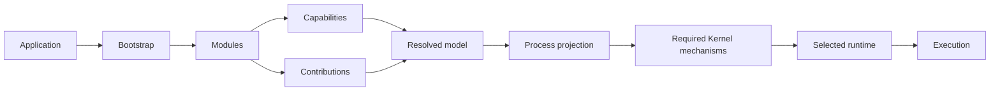
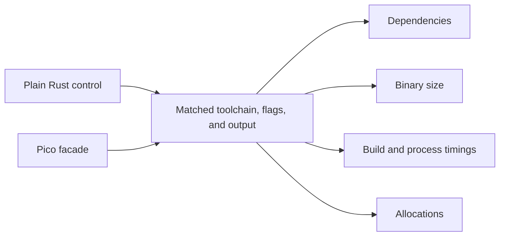

# RustClamp

**Compose. Run. Scale.** A composable application framework for Rust.

A small synchronous entrypoint for Clamp applications.

```rust
use rustclamp::prelude::*;

fn main() {
    Clamp::run(|| {
        println!("Hello Clamp");
    });
}
```

`Clamp::run` calls the closure once on the current thread and returns its result
unchanged. Captures may borrow local data or consume owned values. Errors and
panics keep ordinary Rust behavior. This path needs no Core, Kernel or Runtime.

Run Pico from this repository with `cargo run --offline --example 00-pico`.
Rust 1.96.1 is the tested minimum; the facade has no dependencies. Publishing is
disabled until licensing, registry ownership and the prototype API are reviewed.

See the [Pico results](docs/evidence/phase1.md) for measured costs and limitations.
The example and source are available in the `rustclamp` repository. Package checks
run in independent repositories and in the combined developer checkout.

## Target Architecture

The target model grows from selected process roots. Reachability determines
which modules, providers, contributions, configuration, and resources participate.
The Kernel coordinates the resolved projection; a selected runtime drives work.
Only the Pico entrypoint has been proven so far; later stages remain experimental.



## Pico Comparison

These results are a paired baseline on one recorded host, not a universal
performance guarantee.

| Metric | Plain Rust | Pico | Difference |
| --- | ---: | ---: | ---: |
| Resolved dependency packages | 0 | 1 facade | +1 |
| Facade dependencies | — | 0 | — |
| Clean-build median | 232.40 ms | 269.18 ms | +36.78 ms |
| Unchanged rebuild median | 133.48 ms | 135.15 ms | +1.67 ms |
| Release binary size | 4,335,592 B | 4,335,592 B | 0 B |
| Entrypoint allocations | 0 | 0 | 0 |

Build results use five paired repetitions and fresh target directories. Process
timings include process creation, stdout and exit, so the small median difference
does not establish a reliable initialization penalty. See the [full Phase 1
report](docs/evidence/phase1.md) and [raw measurements](docs/evidence/reports/phase1-pico.json).



```sh
cargo fmt --all -- --check
cargo clippy --offline --locked --all-targets --all-features -- -D warnings
cargo test --offline --locked --all-features
RUSTDOCFLAGS="-D warnings" cargo doc --offline --locked --no-deps --all-features
```

For coordinated checkout, architecture checks, measurements, and release policy,
see the [facade contributor guide](https://github.com/rustclamp/rustclamp/blob/main/CONTRIBUTING.md).
The configured remote is `https://github.com/rustclamp/rustclamp.git`; repository existence
and public visibility were verified during Phase 0.
