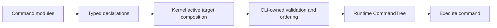
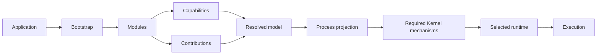
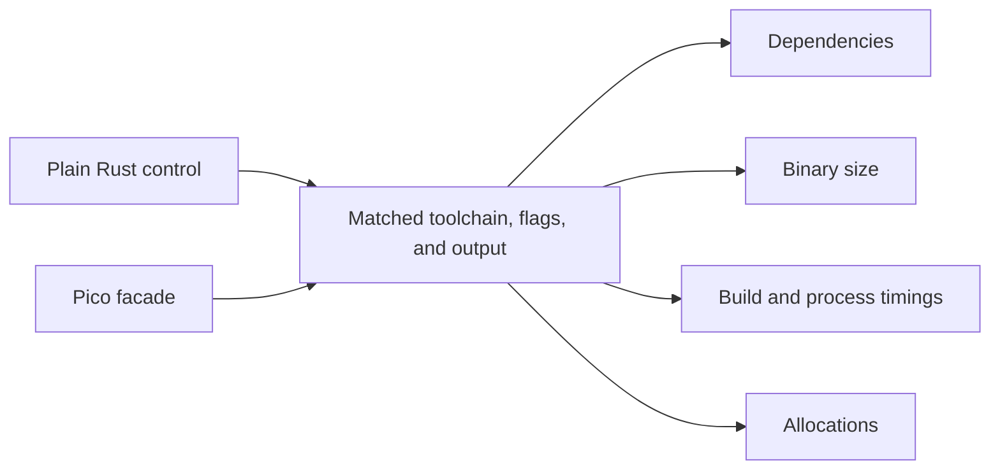

# RustClamp

**RustClamp is a composable application framework for Rust.** This is its main
framework repository. The `core`, `kernel`, and `runtime` repositories are planned
companion components, not separate products.

A small synchronous entrypoint for Clamp applications.

```rust
use rustclamp::prelude::*;

fn main() {
    Clamp::run(|| {
        println!("Hello Clamp");
    });
}
```

`Clamp::run` calls the closure once on the current thread and returns its result
unchanged. Captures may borrow local data or consume owned values. Errors and
panics keep ordinary Rust behavior. This path needs no Core, Kernel or Runtime.

Run Pico from this repository with `cargo run --offline --example 00-pico`.
Rust 1.96.1 is the tested minimum; the facade has no dependencies.
The optional `web` feature adds `rustclamp::web`, a std-only HTTP server with
routes, JSON and static files from `public/`; `clamp init --web` projects use it.
Reusable features ship as packages: a crate implementing `web::Package` brings its
own routes, middleware, views and tests, and an app adds it with
`Router::package` ([ADR 0008](docs/adr/0008-web-packages.md)). Publishing is
disabled until licensing, registry ownership and the prototype API are reviewed.

See the [Pico results](docs/evidence/phase1.md) for measured costs and limitations.
The example and source are available in the `rustclamp` repository. Package checks
run in independent repositories and in the combined developer checkout.

Two facade-free Phase 2 consumers are also runnable from this repository:
`examples/01-capability` demonstrates direct Clock injection with Core, and
`examples/02-module` declares a Greeter requirement and Clock provider through
Core and resolves them through Kernel. Their tests run with
`python3 tools/check.py`.

`examples/03-contribution` adds a typed CLI command target. Core exposes only
generic declaration/target contracts, Kernel checks that required declarations
are consumed, and the CLI target owns duplicate-name validation, deterministic
ordering, empty-tree behavior, and runtime command execution. This is a focused
target prototype, not a production console package or process projection.

`examples/04-process` prototypes the Phase 4 composition boundary: one
application blueprint resolves separate CLI and Worker projections; required
and optional providers, defaults, explicit selection, replacement, qualified
contributions, and exclusions are validated only when reachable. Worker-only
configuration is read only for Worker. The immutable freeze result provides
both a compact runtime plan and structured inspection metadata, including
inclusion paths and exclusion reasons. This remains a small in-memory
prototype, not full runtime or lifecycle integration. Its
[Phase 4 evidence](docs/evidence/phase4.md) records architecture checks,
process-specific build targets, and scale measurements.

`examples/05-lifecycle` begins Phase 5 with a synchronous fake-resource proof:
it derives Database → Users startup and reverse cleanup from the frozen process
requirements, exercises failure cleanup and programmatic shutdown, and compares
managed with caller-owned Database lifetimes. Bounded fake-clock lifecycle
operations include task stop and final diagnostic flush with an in-memory
fallback. Coexisting projections prove shared application database lifetime and
isolated process state; explicit execution handles demonstrate execution scope.
The lifecycle outcome exposes dependency edges, owners, phase participation,
and cleanup state. The separate Runtime package defines executor-neutral task
supervision and an optional Tokio adapter selected per process. These remain prototype contracts; the base task contract is synchronous, and
the optional Tokio adapter also supports native async tasks.
The [Phase 5 progress report](docs/evidence/phase5-lifecycle.md) compares its
build footprint with the Phase 4 process example and separates measured process
wall time from deterministic fake-clock readiness durations.
Core now provides opt-in phase traits and an identity-only lifecycle context;
they add no dispatcher or runtime, and modules that implement only `Module`
remain unchanged.

`examples/06-users` demonstrates one Users operation used directly, from a
console command, through optional Axum HTTP, and with memory or PostgreSQL
repositories. `rustclamp-http` owns HTTP routing, middleware, representations,
streaming, and listener drain while exposing Axum types. `rustclamp-postgres`
owns qualified SQLx pools and explicit migration planning; application adapters
keep SQL and execution transactions. The console-only build excludes HTTP,
PostgreSQL, and Tokio. See the [Phase 6 evidence](docs/evidence/phase6-progress.md)
and [integration boundary decision](docs/adr/0005-phase6-integration-boundaries.md).
Release build, dependency, binary, process, and paired workload measurements
are recorded in the [Phase 6 evidence](docs/evidence/phase6-progress.md).

`examples/11-device-loop` demonstrates fixed-step replay, controlled
clock/random/input sources, validated fake sensor samples, bounded input
backpressure, display/optional telemetry, typed CAN decoder assembly, and
process-specific sync/async runtime selection. Its default graph excludes
Tokio. `examples/12-platform-neutral` shows a `#![no_std]` Core consumer using
alloc without Kernel or Runtime. See the
[Phase 8 evidence](docs/evidence/phase8-progress.md) for portability findings
and scale/footprint measurements.

`examples/13-site-server` serves either Python-built site through Clamp's public
HTTP route target. It lets the Rust and Python previews share generated files for
a direct response comparison; it is a hosting proof, not a rewrite of the
Python generator. See the [Phase 9 progress evidence](docs/evidence/phase9-progress.md).

The standalone [`clamp` developer tool](tooling/README.md) installs with
`curl -fsSL https://rustclamp.com/install.sh | sh`, which downloads the latest
[release binary](https://github.com/rustclamp/rustclamp/releases) (`clamp-v*`
tags), or from a checkout with `cargo install --path tooling`. `clamp init`
creates a blank, app, web or TUI project, or a package with `--package`; `clamp
dev` runs `Procfile.dev`; `clamp self-update` and `clamp --version` manage the
install. It also passes Cargo commands through and inspects versioned JSON
exported from a resolved Kernel process projection. Inspection is architecture metadata; it does not discover
source declarations or report configuration evaluation and lifecycle state.
The separate [starter kits](starter-kits/README.md) include a Vue 3 todo demo
using Vite+.

## Project Map

| Repository | Responsibility | Status |
| --- | --- | --- |
| [`rustclamp`](https://github.com/rustclamp/rustclamp) | Main framework facade and application entry point | Pico is implemented and measured |
| [`core`](https://github.com/rustclamp/core) | Shared, domain-neutral contracts | Capabilities, modules, contributions, and application/process identities |
| [`kernel`](https://github.com/rustclamp/kernel) | Composition and resolution | Typed resolution, contribution assembly, and process-root reachability prototype |
| [`runtime`](https://github.com/rustclamp/runtime) | Execution-environment contracts | Executor-neutral task supervision; optional Tokio adapter |
| [`http`](https://github.com/rustclamp/http) | Optional HTTP integration | Axum/Tower routing, context, presentation, streaming, and graceful listener service |
| [`postgres`](https://github.com/rustclamp/postgres) | Optional PostgreSQL integration | Qualified SQLx pools, ownership, health probes, and explicit migrations |
| [`docs.rustclamp.com`](https://github.com/rustclamp/docs.rustclamp.com) | User and architecture documentation | Supporting repository, not a framework component |
| [`rustclamp.com`](https://github.com/rustclamp/rustclamp.com) | Project website | Supporting repository, not a framework component |

Today, the demonstrated facade path is `Clamp::run`: it runs a closure
synchronously on the current thread. Core defines `Clock` and additive module
contracts; Kernel resolves declared typed requirements, reports composition
errors, validates cycles, and now prototypes process-root reachability. These
are reusable prototypes, not automatic whole-application discovery. Full
process composition and runtime integration are not implemented. The target
architecture below remains a design direction, not a working end-to-end
pipeline.
“Application modules” means modules in a user's application, not these companion
repositories.

## Phase 1 and Phase 2 Measurements

Phase 1 measured the Pico facade against plain Rust. Phase 2 measured Kernel's
typed capability resolver against direct typed access. The workloads differ, so
the phase columns below are context, not a before/after speedup comparison.

| Metric | Phase 1: plain Rust | Phase 1: Pico | Phase 2: Kernel |
| --- | ---: | ---: | ---: |
| Clean-build median | 232.40 ms | 269.18 ms | 467.77 ms |
| Unchanged rebuild median | 133.48 ms | 135.15 ms | 39.47 ms |
| Process wall-time median | 1.203 ms | 1.256 ms | 1.484 ms |
| Release binary size | 4,335,592 B | 4,335,592 B | 4,357,888 B |
| Dependency packages | 0 | 1 facade | 1 internal (Core) |

The Phase 2 examples measure the consumer boundaries directly. Their results
are separate programs, not an isolated overhead comparison:

| Metric | `01-capability` (Core) | `02-module` (Core + Kernel) |
| --- | ---: | ---: |
| Resolved internal dependencies | 1 | 2 |
| Clean release build median, 3 runs | 300.31 ms | 675.50 ms |
| Unchanged release build median | 41.98 ms | 40.52 ms |
| Release executable size | 4,345,912 B | 4,354,696 B |
| Process wall-time median | 1.430 ms | 1.234 ms |

The paired Phase 1 plain Rust/Pico result remains the relevant facade baseline:
Pico added 0 bytes and measured 0 entrypoint allocations in that specific
closure example. The Phase 2 applications have different behavior and
dependencies, so their binary/build differences do not estimate framework
overhead. Full sample ranges and commands are in the
[Phase 2 evidence](docs/evidence/phase2.md).

Phase 1's paired comparison found Pico added 36.78 ms to the clean-build
median, 1.67 ms to the unchanged-build median, and 0 bytes to the binary. Phase
2's latest resolver microbenchmark measured direct access at 2 ns/op,
unqualified resolution at 6 ns/op, selection from two providers at 12 ns/op,
and selection from eight at 28 ns/op. Typed `Primary` paths measured 5/27 ns
for one/eight providers; optional absent/unique paths were 7/3 ns; collecting
all providers was 17/40 ns for two/eight. Removing a module and revalidating
measured 36 ns, replacing a provider and revalidating 62 ns. These are
nine-sample medians, not end-to-end latency. The two-provider selection range
was 12-13 ns in the latest run. Earlier Phase 2 runs recorded unqualified
5/12/31, 7/11/27, 8/12/29, then 6/21/27 ns; the resolver and harness changed between snapshots,
so the runs do not isolate individual feature costs. Many-provider and
composition-edit timings include allocated snapshots/vectors.

The first Phase 2 build snapshot was 416.90 ms clean, 40.37 ms unchanged,
4,365,760 B, and 1.516 ms process wall time. The latest follow-up on the same
example is +50.87 ms clean, -0.89 ms unchanged, -7,872 B, and -0.032 ms process
time. This compares source versions on one uncontrolled host; it does not
isolate feature costs. The process measurement includes launch and output.

The build and process numbers between phases are not apples-to-apples: Phase 1
uses matched plain/Pico hello-world consumers, while Phase 2 builds/runs a
Kernel clock-resolution example with Core. The Phase 2 process measurement also
includes process launch, output, and exit. Do not interpret the cross-phase
difference as a regression or improvement. See [Phase 1 evidence](docs/evidence/phase1.md)
and [Phase 2 evidence](docs/evidence/phase2.md) for methods, limitations, and raw
samples.

## Phase 3: Contribution Target Prototype

The third example proves a small domain-owned assembly path. Hello and Goodbye
modules declare commands; Kernel carries typed declarations and catches
required orphans; the CLI target owns duplicate checking, alphabetical order,
and the built command tree. Public and admin command declarations have distinct
types. The tree runs commands without retaining the full composition metadata.



| Metric | Phase 3 observation |
| --- | ---: |
| Assembly of two commands | 86 ns/op median |
| Runtime tree storage | 96 B, including vector capacity |
| Clean release build | 1.116 s median, 3 runs |
| Unchanged release rebuild | 61.84 ms median |
| Release executable | 4,367,280 B |
| Internal dependencies | Core + Kernel; no facade |

These figures describe a tiny synthetic target, not total framework overhead.
Allocation calls are not instrumented, process time includes launch/output, and
Phase 2 examples are not a comparable baseline. Full commands, samples,
limitations, and test cases are in the
[Phase 3 evidence](docs/evidence/phase3.md).

## Target Architecture

The target model grows from selected process roots. Reachability determines
which modules, providers, contributions, configuration, and resources participate.
The Kernel coordinates the resolved projection; a selected runtime drives work.
Pico is the only end-to-end facade path. Capability resolution is currently a
focused Kernel prototype; later stages remain experimental.



## Pico Comparison

These results are a paired baseline on one recorded host, not a universal
performance guarantee.

| Metric | Plain Rust | Pico | Difference |
| --- | ---: | ---: | ---: |
| Resolved dependency packages | 0 | 1 facade | +1 |
| Facade dependencies | — | 0 | — |
| Clean-build median | 232.40 ms | 269.18 ms | +36.78 ms |
| Unchanged rebuild median | 133.48 ms | 135.15 ms | +1.67 ms |
| Release binary size | 4,335,592 B | 4,335,592 B | 0 B |
| Entrypoint allocations | 0 | 0 | 0 |

Build results use five paired repetitions and fresh target directories. Process
timings include process creation, stdout and exit, so the small median difference
does not establish a reliable initialization penalty. See the [full Phase 1
report](docs/evidence/phase1.md) and [raw measurements](docs/evidence/reports/phase1-pico.json).



```sh
cargo fmt --all -- --check
cargo clippy --offline --locked --all-targets --all-features -- -D warnings
cargo test --offline --locked --all-features
RUSTDOCFLAGS="-D warnings" cargo doc --offline --locked --no-deps --all-features
```

For coordinated checkout, architecture checks, measurements, and release policy,
see the [facade contributor guide](https://github.com/rustclamp/rustclamp/blob/main/CONTRIBUTING.md).
The configured remote is `https://github.com/rustclamp/rustclamp.git`; repository existence
and public visibility were verified during Phase 0.
