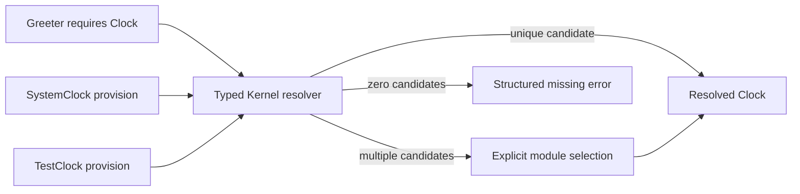

# Phase 2: Capabilities and Module Prototypes

Date: 2026-09-28. This evidence covers typed capability resolution, additive
module contracts, and caller-owned composition prototypes. It does not claim
automatic whole-application composition or process projection.

## Behavior

Core defines `Clock`, typed `ClockCapability`, and additive `Module`,
`Requires<C>`, and `Provides<C>` contracts. Kernel adapts these declarations to
typed provisions and requirements, while retaining explicit constructor APIs
for local composition. A unique candidate resolves directly; multiple
candidates require explicit selection. Missing, ambiguous, unavailable, and
cyclic compositions have structured diagnostics. No global registry, `TypeId`,
or `Any` map is used. Request identity, principal, transaction placeholder, and
tick state are ordinary call data in the facade-free application example, not
capabilities.



## Verification

| Case | Result |
| --- | --- |
| One typed provision | Resolves the expected clock value |
| No provision | Missing-provider error identifies Greeter and Clock |
| Two provisions in either order | Equal ambiguity error with sorted candidate IDs |
| Explicit alternative selection | Selects the requested test clock |
| Selected module unavailable | Structured selection error includes available candidates |
| Duplicate selected module identity | Rejected as ambiguous; registration order cannot choose a value |
| External module using Core+Kernel only | Builds and tests without the facade package |
| Two independent composition snapshots | Provider replacement preserves both the old snapshot and the other composition |
| Request/principal/transaction/tick state | Separate invocation values passed to the operation; no registry entry |
| Borrowed `Rc<Cell<_>>` Clock | Resolves without `Send`, `Sync`, `Arc`, or locking bounds |
| Acyclic dependency chain at 2,048 modules | Validates using an iterative traversal without call-stack growth |

Core and Kernel formatting, Clippy, tests, examples, and rustdoc pass. The
facade-free module application uses the exact public contracts from Core and
Kernel. Both example packages are checked by the coordinated test runner, and
Cargo metadata verifies neither depends on the facade.

## Ownership and Threading

The prototype imposes no `Send` or `Sync` bound on `Clock`, module contracts,
provisions, or resolution. `Provision<'a, C>` borrows its provider value, and
resolved values keep that borrow; the owner must therefore outlive each
provision and its use. The local `Rc<Cell<u64>>` integration test demonstrates
a non-`Send`, non-`Sync` provider on the calling thread. Core does not require
`Arc`, a lock, `'static` storage, or an async runtime. This does not promise that
future managed-resource/runtime APIs will use the same bounds; those remain
separate decisions for later phases.

## Measurements

The in-process resolver microbenchmark compares direct typed access with unique
resolution and explicit selection at increasing candidate counts. The clock is
fixed, each sample runs 100,000 operations, two warmup batches precede nine
samples, and the report records the integer nanoseconds per operation.

| Path | Median | Raw samples (ns/op) |
| --- | ---: | --- |
| Direct typed access | 2 ns | 2, 2, 2, 2, 2, 2, 2, 2, 2 |
| Resolve unique provision | 6 ns | 6, 6, 6, 6, 6, 7, 7, 7, 8 |
| Select last of 2 provisions | 12 ns | 12, 12, 12, 12, 12, 12, 12, 12, 13 |
| Select last of 8 provisions | 28 ns | 27, 27, 27, 27, 28, 29, 30, 31, 34 |
| Resolve qualified unique provision (`Primary`) | 5 ns | 5, 5, 5, 5, 5, 6, 6, 6, 6 |
| Select qualified last of 8 (`Primary`) | 27 ns | 26, 26, 26, 27, 27, 27, 28, 29, 31 |
| Optional, no provider | 7 ns | 6, 6, 6, 7, 7, 7, 7, 7, 7 |
| Optional, one provider | 3 ns | 3, 3, 3, 3, 3, 3, 3, 3, 3 |
| Resolve all, 2 providers | 17 ns | 16, 17, 17, 17, 17, 17, 17, 17, 19 |
| Resolve all, 8 providers | 40 ns | 40, 40, 40, 40, 40, 40, 40, 41, 41 |
| Remove module and revalidate | 36 ns | 36, 36, 36, 36, 36, 36, 36, 36, 37 |
| Replace provider and revalidate | 62 ns | 60, 61, 61, 62, 62, 62, 62, 63, 74 |
| Validate construction chain, 8 modules | 1,652 ns | 1,636, 1,639, 1,649, 1,652, 1,652, 1,657, 1,662, 1,665, 1,694 |
| Detect 8-module cycle, including path | 1,346 ns | 1,337, 1,338, 1,339, 1,344, 1,346, 1,347, 1,351, 1,360, 1,366 |
| Resolve selected, 1 candidate | 9 ns | 9, 9, 9, 9, 9, 9, 9, 9, 9 |
| Resolve selected, 5 candidates | 20 ns | 19, 20, 20, 20, 20, 20, 20, 20, 20 |
| Resolve selected, 20 candidates | 39 ns | 38, 38, 39, 39, 39, 39, 39, 39, 50 |
| Validate chain, 5 modules | 939 ns | 931, 931, 936, 937, 939, 940, 940, 945, 960 |
| Validate chain, 20 modules | 5,735 ns | 5,698, 5,703, 5,711, 5,711, 5,735, 5,736, 5,741, 5,744, 5,749 |

The initial Phase 2 run recorded 5/12/31 ns for unique/two/eight-provider
resolution. After the shared resolver refactor, a follow-up recorded 7/11/27 ns
and qualified paths at 5/27 ns. The latest run, after adding graph edits,
recorded 6/12/28 ns unqualified and 5/27 ns qualified, plus optional,
many-provider, removal, and replacement paths above. The two-provider selection
range was 12-13 ns in the terminal-runner check; the previous sample ranged
12-32 ns. Resolver
and harness source changed between runs; these are version snapshots, not
controlled estimates of one feature's cost. Many-provider timing includes
constructing and sorting the returned vector; composition edit timings include
snapshot copies and validation. Allocation counts are not instrumented. These remain microbenchmark
observations, not application latency guarantees; nanosecond-scale results are
sensitive to host scheduling, frequency, compiler optimization, and timer
granularity. They do not justify a performance threshold. All runs' samples are retained in
[phase2-resolution.json](reports/phase2-resolution.json).

The initial five-run release build report recorded one internal dependency
(Core), a clean-build median of 416.90 ms, unchanged-build median of 40.37 ms,
an example binary of 4,365,760 bytes, and process wall-time median of 1.516 ms.
After the typed qualifier and composition-edit implementations, the same command
measured 467.77 ms clean build, 39.47 ms unchanged rebuild, a 4,357,888-byte
example binary, and 1.484 ms process wall time. Relative to the initial
measurement of the same example, the latest follow-up is +50.87 ms clean build,
-0.89 ms unchanged rebuild, -7,872 bytes, and -0.032 ms process wall time. This
is a source-version comparison on one uncontrolled host, not a causal estimate
of feature cost.
Process timing includes launch, output, and exit; it is not pure resolver
latency. Allocator counts, RSS, CPU, and edited-source rebuilds were not
measured. The single-provider resolver success path contains no explicit
collection; the many-provider path allocates a sorted output vector, while error
construction collects candidate IDs. These source observations are not allocator
measurements. Raw reports:
[initial](reports/phase2-kernel-build.json),
[latest follow-up](reports/phase2-kernel-build-followup.json).

### Facade-Free Consumer Examples

Both examples use three fresh release target directories, immediate unchanged
rebuilds, the shared Rust 1.96.1 toolchain, x86_64 Linux, and the same release
profile. Their source and workloads differ; this table measures each proof, not
the isolated cost of traits or Kernel.

| Example | Internal dependency packages | Clean builds, s | Median clean | No-op rebuilds, s | Median no-op | Binary bytes | Process times, ms | Median process |
| --- | ---: | --- | ---: | --- | ---: | --- | --- | ---: |
| `a1-capability` | 1 (Core) | 0.560, 0.285, 0.300 | 0.300 | 0.042, 0.041, 0.042 | 0.042 | 4,345,912 each | 1.430, 1.631, 1.131 | 1.430 |
| `a2-module` | 2 (Core, Kernel) | 0.676, 0.694, 0.671 | 0.676 | 0.041, 0.041, 0.039 | 0.041 | 4,354,696 each | 1.234, 1.280, 1.102 | 1.234 |

The `a2-module` binary is 8,784 bytes larger in this sample and has one
additional internal dependency. These are different programs, so the delta is
not a causal estimate of composition overhead. The Phase 1 paired plain/Pico
comparison remains the appropriate facade baseline. Process times include
launch, output, and exit. Full raw data and commands are preserved in
[the capability report](reports/phase2-capability-example.json) and
[the module report](reports/phase2-module-example.json).

Run either example from the facade repository:

```sh
cargo test --offline --locked --manifest-path examples/a1-capability/Cargo.toml
cargo run --offline --locked --manifest-path examples/a1-capability/Cargo.toml --example a1-capability
cargo test --offline --locked --manifest-path examples/a2-module/Cargo.toml
cargo run --offline --locked --manifest-path examples/a2-module/Cargo.toml --example a2-module
```

Environment: Rust/Cargo 1.96.1, x86_64 Linux, AMD Ryzen 5 PRO 4650U, release
profile at opt-level 3. Compiler wrappers and extra Rust flags are unset. OS
caches and host load are uncontrolled.
