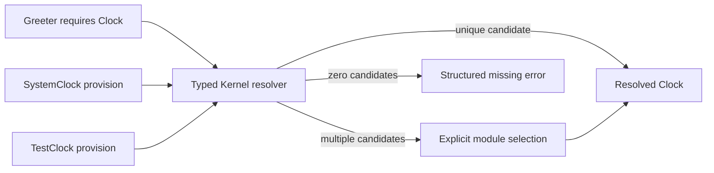

# Phase 2: Clock Capability Resolution

Date: 2026-09-28. This evidence covers the first typed capability slice only;
it does not claim full module composition, qualifiers, or process projection.

## Behavior

Core defines `Clock` and the typed `ClockCapability` marker. Kernel associates a
provision with a stable module identity and resolves one typed requirement. A
unique candidate resolves directly; multiple candidates require explicit
selection. Missing, ambiguous, and unavailable selections retain structured
error kinds, the requiring module, capability identity, and sorted candidates.
No global registry, `TypeId`, or `Any` map is used.

## Verification

| Case | Result |
| --- | --- |
| One typed provision | Resolves the expected clock value |
| No provision | Missing-provider error identifies Greeter and Clock |
| Two provisions in either order | Equal ambiguity error with sorted candidate IDs |
| Explicit alternative selection | Selects the requested test clock |
| Selected module unavailable | Structured selection error includes available candidates |
| Duplicate selected module identity | Rejected as ambiguous; registration order cannot choose a value |

Core and Kernel formatting, Clippy, tests, examples, and rustdoc pass. The
capability example runs with a system clock and with a deterministic clock fixed
at Unix second 42.

## Measurements

The in-process resolver microbenchmark compares direct typed access with unique
resolution and explicit selection at increasing candidate counts. The clock is
fixed, each sample runs 100,000 operations, two warmup batches precede nine
samples, and the report records the integer nanoseconds per operation.

| Path | Median | Raw samples (ns/op) |
| --- | ---: | --- |
| Direct typed access | 2 ns | 2, 2, 2, 2, 2, 2, 2, 2, 2 |
| Resolve unique provision | 5 ns | 5, 5, 5, 5, 5, 5, 5, 5, 5 |
| Select last of 2 provisions | 12 ns | 12, 12, 12, 12, 12, 12, 12, 12, 13 |
| Select last of 8 provisions | 31 ns | 31, 31, 31, 31, 31, 31, 31, 31, 31 |

These values are first-run microbenchmark observations, not an application
latency guarantee. Nanosecond-scale results are sensitive to host scheduling,
frequency, compiler optimization, and timer granularity. They do not justify a
performance threshold; compare future changes using the same harness and control.
Raw benchmark input and samples: [phase2-resolution.json](reports/phase2-resolution.json).

The separate five-run release build report records one internal dependency
(Core), a clean-build median of 416.90 ms, unchanged-build median of 40.37 ms,
an example binary of 4,365,760 bytes, and process wall-time median of 1.516 ms.
Process timing includes launch, output, and exit; it is not pure resolver latency.
Allocator counts, RSS, CPU, and edited-source rebuilds were not measured. The
successful resolver path contains no explicit collection or allocation, while
error construction collects candidate IDs; this source observation is not an
allocator measurement. Full environment and raw build samples:
[phase2-kernel-build.json](reports/phase2-kernel-build.json).

Environment: Rust/Cargo 1.96.1, x86_64 Linux, AMD Ryzen 5 PRO 4650U, release
profile at opt-level 3. Compiler wrappers and extra Rust flags are unset. OS
caches and host load are uncontrolled.
