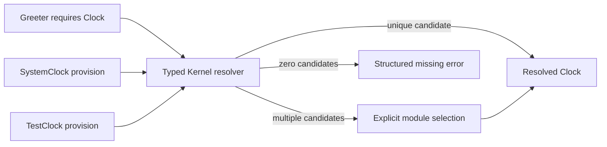

# Phase 2: Clock Capability Resolution

Date: 2026-09-28. This evidence covers the first typed capability slice only;
it does not claim full module composition, qualifiers, or process projection.

## Behavior

Core defines `Clock` and the typed `ClockCapability` marker. Kernel associates a
provision with a stable module identity and resolves one typed requirement. A
unique candidate resolves directly; multiple candidates require explicit
selection. Missing, ambiguous, and unavailable selections retain structured
error kinds, the requiring module, capability identity, and sorted candidates.
No global registry, `TypeId`, or `Any` map is used.

## Verification

| Case | Result |
| --- | --- |
| One typed provision | Resolves the expected clock value |
| No provision | Missing-provider error identifies Greeter and Clock |
| Two provisions in either order | Equal ambiguity error with sorted candidate IDs |
| Explicit alternative selection | Selects the requested test clock |
| Selected module unavailable | Structured selection error includes available candidates |
| Duplicate selected module identity | Rejected as ambiguous; registration order cannot choose a value |

Core and Kernel formatting, Clippy, tests, examples, and rustdoc pass. The
capability example runs with a system clock and with a deterministic clock fixed
at Unix second 42.

## Measurements

The in-process resolver microbenchmark compares direct typed access with unique
resolution and explicit selection at increasing candidate counts. The clock is
fixed, each sample runs 100,000 operations, two warmup batches precede nine
samples, and the report records the integer nanoseconds per operation.

| Path | Median | Raw samples (ns/op) |
| --- | ---: | --- |
| Direct typed access | 2 ns | 2, 2, 2, 2, 2, 2, 2, 2, 2 |
| Resolve unique provision | 8 ns | 8, 8, 8, 8, 8, 8, 8, 8, 8 |
| Select last of 2 provisions | 12 ns | 12, 12, 12, 12, 12, 12, 12, 12, 13 |
| Select last of 8 provisions | 29 ns | 27, 27, 28, 28, 29, 29, 29, 31, 31 |
| Resolve qualified unique provision (`Primary`) | 6 ns | 6, 6, 6, 6, 6, 6, 6, 6, 6 |
| Select qualified last of 8 (`Primary`) | 27 ns | 26, 27, 27, 27, 27, 27, 27, 27, 29 |
| Optional, no provider | 6 ns | 6, 6, 6, 6, 6, 6, 7, 7, 7 |
| Optional, one provider | 3 ns | 3, 3, 3, 3, 3, 3, 3, 3, 3 |
| Resolve all, 2 providers | 17 ns | 17, 17, 17, 17, 17, 17, 17, 17, 19 |
| Resolve all, 8 providers | 40 ns | 39, 39, 39, 40, 40, 40, 40, 40, 40 |

The initial Phase 2 run recorded 5/12/31 ns for unique/two/eight-provider
resolution. After the shared resolver refactor, a follow-up recorded 7/11/27 ns
and qualified paths at 5/27 ns. The latest run, after adding optional and many
cardinality APIs, recorded 8/12/29 ns unqualified and 6/27 ns qualified, plus
the optional and many paths above. Resolver and harness source changed between
runs, so these are version snapshots, not controlled estimates of the cost of
one feature. Many-provider timing includes constructing and sorting the returned
vector; allocation counts are not instrumented. These remain microbenchmark
observations, not application latency guarantees; nanosecond-scale results are
sensitive to host scheduling, frequency, compiler optimization, and timer
granularity. They do not justify a performance threshold. All runs' samples are retained in
[phase2-resolution.json](reports/phase2-resolution.json).

The initial five-run release build report recorded one internal dependency
(Core), a clean-build median of 416.90 ms, unchanged-build median of 40.37 ms,
an example binary of 4,365,760 bytes, and process wall-time median of 1.516 ms.
After the typed qualifier implementation, the same command measured 451.79 ms
clean build, 41.87 ms unchanged rebuild, a 4,357,888-byte example binary, and
1.297 ms process wall time. Relative to the initial measurement of the same
example, the latest follow-up is +50.53 ms clean build, +0.12 ms unchanged rebuild,
-7,872 bytes, and -0.063 ms process wall time. This is a source-version
comparison on one uncontrolled host, not a causal estimate of qualifier cost.
Process timing includes launch, output, and exit; it is not pure resolver
latency. Allocator counts, RSS, CPU, and edited-source rebuilds were not
measured. The successful resolver path contains no explicit collection or
allocation, while error construction collects candidate IDs; this source
observation is not an allocator measurement. Raw reports:
[initial](reports/phase2-kernel-build.json),
[latest follow-up](reports/phase2-kernel-build-followup.json).

Environment: Rust/Cargo 1.96.1, x86_64 Linux, AMD Ryzen 5 PRO 4650U, release
profile at opt-level 3. Compiler wrappers and extra Rust flags are unset. OS
caches and host load are uncontrolled.
