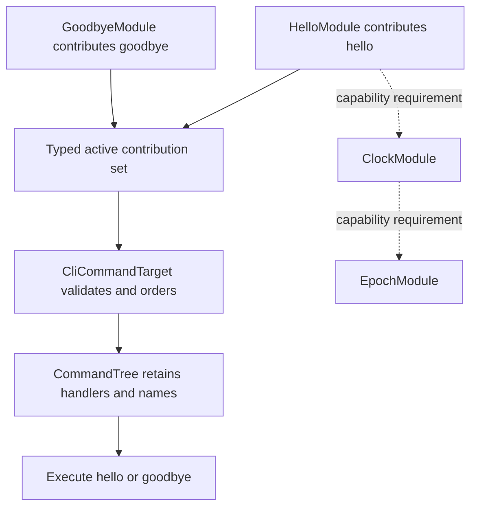

# Phase 3 Evidence: Contributions and Domain-Owned Targets

Phase 3 proves that generic composition contracts can feed a domain-owned
target without moving command rules into Core or Kernel. The working fixture is
[`examples/03-contribution`](../../examples/03-contribution/README.md).

## Composition Flow

| General API in Core/Kernel | CLI-specific example behavior |
| --- | --- |
| Stable contribution and target identities | Command names are unique |
| `Contribution` and `ContributionTarget` contracts | Alphabetical command order |
| `TargetComposition<T, Q>` preserves target/qualifier types | Empty command tree is valid |
| Required orphan diagnostics identify typed target context | `hello` reads Clock; `goodbye` is clock-free |
| Target errors are returned without interpreting their domain | Runtime lookup and unknown-command behavior |

Target assembly consumes the collection. The resulting tree retains only
command names and function pointers, not contributor identities or the
composition wrappers. Public and admin declarations use distinct Rust types;
the tests exercise both and a rustdoc compile-fail case checks cross-target
type rejection. Process projection is not implemented, so orphan diagnostics
apply only to the active contribution collection supplied to Kernel.

## Verification

The isolated example tests verify successful execution, required capability
resolution through `HelloModule -> ClockModule -> EpochModule`, deterministic
duplicate diagnostics, missing Clock at execution, required unconsumed
declarations, empty input, qualifier separation, target construction without
resource initialization, and a third-party target implemented only against the
public extension traits.

The full coordinated test runner now includes this example, Clippy, Rustdoc,
the tests, its executable, and its benchmark. Run it with
`python3 tools/check.py` from the facade repository.

## Measurements

Environment: Rust/Cargo 1.96.1, `x86_64-unknown-linux-gnu`, Linux 6.18.53,
AMD Ryzen 5 PRO 4650U, release profile. The standalone measurement tool used
three fresh target directories for clean builds and immediately repeated each
build for the unchanged-cache measurement.

| Metric | Phase 3 result |
| --- | ---: |
| Target assembly: two declarations | 86 ns/op median; samples 84, 84, 85, 86, 86, 87, 91, 94, 96 ns |
| Runtime tree storage | 96 B for two entries, including actual backing-vector capacity |
| Clean build | 1.116 s median; samples 1.524, 1.116, 1.112 s |
| Unchanged rebuild | 61.84 ms median; samples 61.84, 63.77, 60.26 ms |
| Executable size | 4,367,280 B for all three builds |
| Process wall time | 1.736 ms median; samples 1.660, 2.413, 1.736 ms |
| Internal dependencies | 2 (Core and Kernel); no facade dependency |

Allocation counts are not instrumented. The target builds temporary sortable
storage and a final runtime vector; this example's benchmark also creates its
owned input vector for each measured build. The executable wall time includes
spawn and I/O, and is not an isolated startup measurement. No Phase 2 number is
an apples-to-apples baseline for this distinct program, and the 86 ns figure is
a small synthetic assembly workload, not an end-to-end application latency.
The raw Cargo report, machine details, commands, and sample arrays are in
[`phase3-contribution-example.json`](reports/phase3-contribution-example.json).
