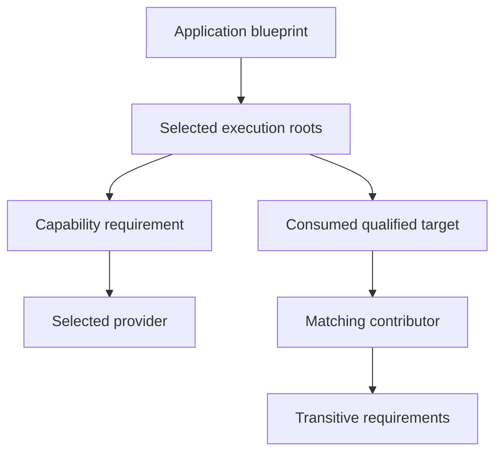

# Phase 4 Progress: Process Roots and Reachability

This is an incremental record of P4-01 and P4-02, not the Milestone 1 report.
The next tasks still need provider selection/replacement, configuration,
process-aware validation, freeze, full inspection, and scale evidence.

## Current Model

The Kernel `ApplicationBlueprint` stores stable application, process, and
execution identities; declared modules; process roots; already selected
capability-provider links; qualified target consumers; and contribution edges.
Projection is a deterministic breadth-first walk. It returns included modules,
excluded declared modules, and one deterministic root-to-module provenance path
for each included module. The example's projection output and execution consume
the same result.

| Test | Result |
| --- | --- |
| CLI reaches CLI root, then command contributor's Clock and transitive Epoch | Pass |
| Worker reaches Worker root, Queue and shared Clock chain | Pass |
| Dormant module with missing provider does not block CLI | Pass |
| Two roots share a provider without duplicating it | Pass |
| Missing process, root execution, and reachable module are structured errors | Pass |

P4-03 and later resolution semantics are not implied: `require_provider` takes
the selected provider identity as input. This stage establishes process-root
reachability over explicit architecture links, not the whole bootstrap pipeline.
