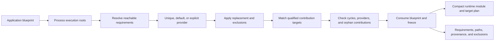

# Phase 4: Process Projection, Freeze, and Inspection

**Result:** the process-composition prototype is implemented and measured. It
demonstrates one application blueprint resolving CLI and Worker independently,
then freezing selected projections into runtime and inspection views. This is
not automatic production module construction or a production lifecycle/runtime.

## Model



The graph has separate process roots, capability requirements/providers, and
target/contribution edges. Ownership and lifecycle relations are not represented
here; this report does not infer them. `ProcessId` is a logical execution
projection and is not a claim about OS process boundaries or shared resources.

## Prototypes

The five runnable examples are:

- [00 Pico](../../examples/00-pico/main.rs): minimal facade path and baseline.
- [01 Capability](../../examples/a1-capability/examples/a1-capability.rs): direct typed capability injection.
- [02 Module](../../examples/a2-module/examples/a2-module.rs): module requirement/provider resolution.
- [03 Contribution](../../examples/a3-contribution/README.md): domain-owned target assembly.
- [04 Process](../../examples/a4-process/README.md): roots, projection, configuration isolation, freeze, and inspection.

## Behavior and Tests

The process projection integration tests cover:

| Case | Result |
| --- | --- |
| Unknown process, missing execution, undeclared root module, or empty roots | Structured error identifies application and process |
| Missing, unavailable, excluded, or ambiguous required provider | Projection fails with consumer/capability/qualifier context |
| Equal-precedence defaults | Sorted ambiguity error; explicit selection overrides defaults |
| Optional requirement without a selected provider | No provider is activated |
| Provider replacement with a different dependency subtree | Only replacement and its reachable dependencies are included |
| Reachable dependency cycle | Deterministic closed module path is reported |
| Required contribution without matching active target | Structured orphan-contribution error |
| Dormant invalid requirement or orphan contribution | Does not fail an unrelated projection |
| Same target with different qualifiers across processes | Contributors remain isolated by process and qualifier |
| Frozen blueprint | Runtime module/target plan agrees with inspection; compile-fail doctest rejects structural mutation |

The `a4-process` tests also prove the CLI setting reader is not called when
Worker configuration is absent or malformed. In a combined in-memory host,
Worker's setting reader, factory, target builder, and startup callback each run
once; CLI's command target runs once. CLI and Worker mutable state is independent
in that host fixture. This does not demonstrate sharing across OS processes.

One inspection run (`cargo run --offline --locked --manifest-path
examples/a4-process/Cargo.toml --example a4-process -- inspect cli`) showed the
Clock path as:

```text
example.process.cli-root -> example.process.greeting-command -> example.process.clock
```

The output also listed the resolved capability and qualifier, the command-target
contribution, and dormant/Worker-only modules as unreachable. The structured
inspection is derived from the same frozen resolution as the runtime module plan.

## Runtime Selection vs Build Targets

[`build-targets/`](../../examples/a4-process/build-targets/Cargo.toml) keeps
Kernel optional and offers a runtime-selected binary plus CLI- and Worker-specific
Cargo targets. `cargo tree` reports these internal package closures:

| Mode | Internal packages | Runtime projection can omit Worker? | Cargo omits Kernel? |
| --- | ---: | --- | --- |
| Runtime-selected binary | Core + Kernel (2) | Yes | No |
| CLI-specific target | Core (1) | Not applicable; compiled as CLI-only | Yes |
| Worker-specific target | Core + Kernel (2) | Not applicable; compiled as Worker-only | No |

This proves only that runtime reachability does not strip a dependency already
activated for the executable. The CLI target is intentionally smaller and does
not implement the full Kernel composition path, so its build/binary numbers are
illustrative rather than an apples-to-apples overhead estimate.

The release measurements used `rustclamp/tools/measure.py`, Rust 1.96.1,
x86_64 Linux on an AMD Ryzen 5 PRO 4650U, two
fresh-target repetitions per mode, and immediate unchanged rebuilds. OS page
cache and host load are uncontrolled. Raw JSON samples are linked below.

| Mode | Clean build median | Unchanged rebuild median | Binary bytes | Internal dependency packages |
| --- | ---: | ---: | ---: | ---: |
| Process example | 1,920.21 ms | 38.67 ms | 4,609,920 | 2 |
| Runtime-selected target | 2,014.28 ms | 40.91 ms | 664,504 | 2 |
| CLI-specific target | 248.98 ms | 40.58 ms | 447,832 | 1 |
| Worker-specific target | 1,985.70 ms | 41.56 ms | 661,216 | 2 |

Raw reports: [process example](reports/phase4-process-example.json),
[runtime-selected](reports/phase4-build-runtime.json), [CLI target](reports/phase4-build-cli.json),
and [Worker target](reports/phase4-build-worker.json). These are different
workloads; use the table for footprint context, not causal claims about process
projection. The build-target fixture uses Cargo's default release profile,
while the process example uses explicit release settings. The earlier [Pico baseline](phase1.md) remains the matched
framework/plain-Rust comparison and measured a 0-byte binary delta.

## Scale Measurement

`cargo bench --offline --locked -p rustclamp-kernel --bench process_projection`
measures nine samples per synthetic chain. It times `project()` with blueprint
construction outside the timed region; each projection also materializes a
root-to-module path for every included module. Results are advisory, not an SLO:

| Declared/reachable modules | Median projection cost | Sample range |
| ---: | ---: | ---: |
| 1 | 358 ns | 341-431 ns |
| 5 | 2.882 us | 2.872-2.890 us |
| 20 | 18.039 us | 17.994-18.545 us |
| 50 | 69.627 us | 69.121-71.798 us |
| 100 | 197.922 us | 196.440-204.165 us |
| 500 | 1.771 ms | 1.726-2.026 ms |

An exploratory pre-index sample at 500 modules measured 3.526 ms; the indexed
resolver measured 1.771 ms in a subsequent run (about 50% lower). At 1-50
modules, index setup overhead outweighed scan savings in those exploratory
samples; at 100 modules the later run was about 25% lower. The first run used
fewer iterations per sample, so this is directional evidence, not a controlled
regression threshold. The full nine-sample ranges are listed above. The existing
Kernel resolution benchmark remains separate.

The projection prototype stores a full path on each included module, so dense
inspection of a deep chain entails quadratic total path entries. At 500 nodes the
measured call remains under 2 ms, but path materialization is the main known
scaling ceiling; a parent-index representation with paths materialized on demand
is the next option if larger graphs matter. This model is runtime-declared and
non-generic over module count, so it has no per-module monomorphization growth to
measure. The freeze compile-fail doctest is the representative API diagnostic:
calling `add_module` on `FrozenProcess` is rejected because no such method exists.
The six module counts are inputs to one dynamically declared benchmark binary;
per-count clean builds and binary sizes would not measure a different compiled
architecture. Build/dependency/binary measurements therefore cover the actual
process example and the three explicitly separated Cargo target modes above.

## Validation

Verified commands:

```sh
cargo test --workspace
cargo clippy --workspace --all-targets -- -D warnings
cargo test --manifest-path rustclamp/examples/a4-process/Cargo.toml
cargo test --doc -p rustclamp-kernel
cargo bench --offline --locked -p rustclamp-kernel --bench process_projection
python3 rustclamp/tools/check.py
```

The coordinated runner also checks all three build targets' formatting, Clippy,
tests, execution, and feature-specific dependency closures. Phase 4's composition
acceptance is met for this prototype: selected reachability, projection-scoped
validation/configuration, immutable freeze, inspection/runtime agreement, and
measurements are demonstrated. Do not interpret that milestone review as a claim
that production construction, ownership, lifecycle, OS-process orchestration, or
binary stripping is implemented.

## Remaining API Questions

- Should default precedence become profile-scoped, or remain explicit in a later recipe layer?
- Should replacement chains be supported and validated, or must each capability replacement be a single edge?
- Should full inclusion paths remain eagerly stored, or be materialized from parent links only when inspection asks?
- What target coordination data belongs in Kernel's compact runtime plan when real target values are introduced?
- Which future phase should define ownership, lifecycle, and OS-process boundaries without conflating them with capability reachability?
