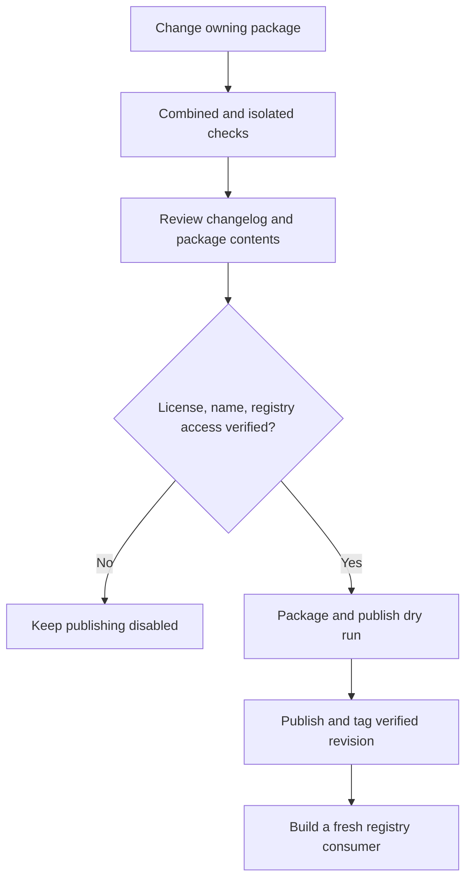

# Package compatibility and releases

Each package has its own version and changelog. Initial scaffolds happen to use
`0.1.0`; that does not require synchronized releases. The facade declares tested
compatible ranges as dependencies appear. Do not expose a lower package's private
implementation as an integration API.

## Release Flow

Use SemVer. During `0.x`, breaking public API changes increment the minor version;
compatible fixes increment the patch version. Public re-exports, documented feature
behavior and MSRV are part of compatibility. Treat an MSRV increase as a breaking
change during this experimental period and document it before release.

Maintain an `Unreleased` section with Added, Changed, Fixed, and Removed subsections
as needed. Before release, record the version and date, migration notes, affected
dependency ranges, supported features, MSRV and verification evidence. Create a
`vX.Y.Z` tag in the owning repository; never retag a published release.

## Publishing gate

All four manifests currently set `publish = false`. Package names, registry
ownership and the project license have not been validated or selected. No package
has been published. Local `cargo package` verifies archive/build mechanics; its
missing-license warning is expected until the owner chooses the license.

Before enabling publication:

1. Confirm crates.io name availability and owner access, choose a license and add
   its text and manifest metadata.
2. Run combined and isolated checks against exact dependency revisions, review the
   changelog and publishable file list with `cargo package --list`.
3. For versioned path dependencies, release lower packages first, then verify the
   normalized manifest and `cargo publish --dry-run` against registry versions.
4. Remove `publish = false` only for the package being released, publish it and
   verify a fresh consumer using the registry version. Tag the verified revision.

No registry-dependent publish dry run is claimed by Phase 0. Core, Kernel and
Runtime may release independently; the facade follows only when it needs their
changes. Initial site repository visibility is separate from Cargo publishing.

## Release Evidence

| Gate | Required evidence |
| --- | --- |
| Package quality | Combined plus isolated format, lint, tests, and rustdoc |
| Boundary safety | Resolved dependency checks for every dependency kind |
| Artifact quality | `cargo package --list`, package verification, publish dry run |
| Consumer behavior | Fresh consumer built from registry versions |
| Compatibility | Changelog, dependency ranges, feature support, MSRV |
| Remote execution | Hosted workflow status, tracked separately from local pass |
