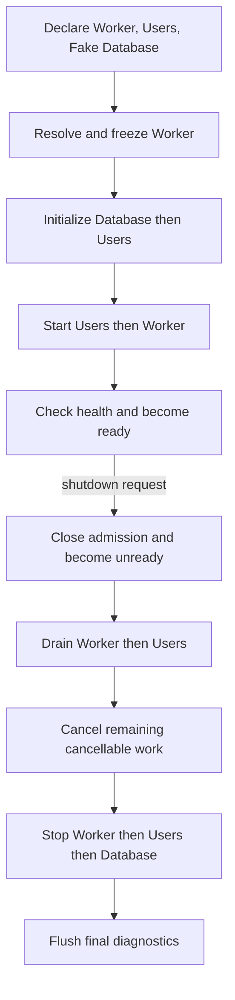

# Lifecycle Coordination Prototype

This example tests a small synchronous lifecycle coordinator against fake
resources. It freezes and validates the selected Worker projection before
running any lifecycle operation. The Worker depends on Users, and Users depends
on the fake Database capability; Kernel's resolved requirements determine
provider-first initialization and consumer-first cleanup.



## Evidence

Eight tests cover dependency-derived order, no readiness after startup or
required-health failure, cleanup of only acquired resources, continued cleanup
after injected errors, deadline handling, optional degradation, programmatic
shutdown, and a bounded final diagnostic flush. Status keeps `started`, `ready`,
`alive`, `accepting_work`, and health as separate values. Cleanup diagnostics
retain both phase and module identity.

| Deterministic fake-clock measure | Result |
| --- | ---: |
| Database + Users initialization | 3 ms |
| Users + Worker start | 2 ms |
| Time to ready in this fixture | 5 ms |
| Drain | 4 ms |
| Reverse-order stop | 3 ms |
| Start through completed shutdown | 12 ms |

These values come from configured fake operation durations. They verify the
measurement path and ordering; they are not wall-clock performance claims.
This proof introduces no dependency and does not implement a production runtime,
real resource, telemetry exporter, or Tokio adapter. Async behavior remains
deferred until the synchronous coordination contract is understood.
Core now exposes independent synchronous lifecycle participation traits, but this
fixture driver has not yet been generalized to dispatch through them.

Release build, binary, dependency, and process-wall measurements are compared
with the Phase 4 process example in the [Phase 5 progress report](../../docs/evidence/phase5-lifecycle.md).

## Run

From the `rustclamp` repository:

```sh
cargo run --offline --locked --manifest-path examples/05-lifecycle/Cargo.toml --example 05-lifecycle
cargo test --offline --locked --manifest-path examples/05-lifecycle/Cargo.toml
```
