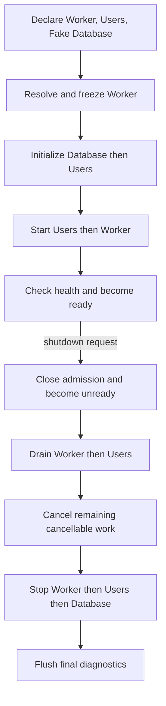

# Lifecycle Coordination Prototype

This example tests a small synchronous lifecycle coordinator against fake
resources. It freezes and validates the selected Worker projection before
running any lifecycle operation. The Worker depends on Users, and Users depends
on the fake Database capability; Kernel's resolved requirements determine
provider-first initialization and consumer-first cleanup.



## Evidence

Twelve default-feature tests cover dependency-derived order, no readiness after startup or
required-health failure, cleanup of only acquired resources, continued cleanup
after injected errors, deadline handling, optional degradation, programmatic
shutdown, and a bounded final diagnostic flush. Status keeps `started`, `ready`,
`alive`, `accepting_work`, and health as separate values. Cleanup diagnostics
retain both phase and module identity.

Two frozen projections from one blueprint also exercise ownership scope: they
share an application-owned fake database, while each gets independent process
state. Stopping either process leaves the other active; stopping both leaves
the database open until its application owner closes it. This is an example
fixture proof, not automatic resource injection in Kernel.

Worker also has two execution roots. An execution resource handle can be
created only for a root in the frozen projection, has independent active
state, and borrows the application database lifetime. The caller creates and
stops the handle directly; there is no locator or transient object manager.

The example's `Outcome::inspection()` reports provider-to-consumer lifecycle
edges, module ownership, implemented phases, and current cleanup state. The
binary prints the same view before its lifecycle event log.

The default build uses Runtime's executor-free manual driver. Worker selects
Tokio while Reporter selects Manual; enabling `tokio-runtime` runs the Worker
task through the optional adapter. Tokio remains absent from the default
dependency graph. Runtime-neutral contracts are synchronous; the optional Tokio adapter provides
native async tasks, supervision, scheduling, and Ctrl-C translation.

| Deterministic fake-clock measure | Result |
| --- | ---: |
| Database + Users initialization | 3 ms |
| Users + Worker start | 2 ms |
| Time to ready in this fixture | 5 ms |
| Drain | 4 ms |
| Reverse-order stop | 3 ms |
| Start through completed shutdown | 14 ms |

These values come from configured fake operation durations. They verify the
measurement path and ordering; they are not wall-clock performance claims.

## Ownership Comparison

| Path | Database owner | Initialize/stop hooks | After process shutdown |
| --- | --- | --- | --- |
| Default | Lifecycle fixture | Both run | Database is closed |
| External | Caller (`ExternalDatabaseOwner`) | Neither runs | Database remains open |

The controlled fixture clock records 5 ms to ready and 14 ms through shutdown
for the managed path, versus 3 ms and 11 ms for the external path. These values
reflect skipped Database hooks, not a production performance advantage.

Both paths provide the Database capability to Users. The caller must close an
external database. Detached-work and restart ownership modes are not modeled.

The lifecycle fixture does not use real resources or a telemetry exporter.
Runtime's optional Tokio feature is available for the supervised task example;
the default build stays executor-free.
The fixture's Database, Users, and Worker participants now opt into Core's
independent synchronous lifecycle traits. This example-local dispatcher invokes
those contracts; it is not a reusable production driver, and ordinary modules
remain lifecycle-free unless they implement the relevant trait.

Release build, binary, dependency, process-wall, task-allocation, and thread
measurements for both feature configurations are in the [Phase 5 evidence](../../docs/evidence/phase5-lifecycle.md).

## Run

From the `rustclamp` repository:

```sh
cargo run --offline --locked --manifest-path examples/05-lifecycle/Cargo.toml --example 05-lifecycle
cargo test --offline --locked --manifest-path examples/05-lifecycle/Cargo.toml
cargo test --offline --locked --all-features --manifest-path examples/05-lifecycle/Cargo.toml
cargo run --offline --locked --manifest-path examples/05-lifecycle/Cargo.toml \
  --example inspection-json --features tooling-inspection > lifecycle-architecture.json
```

The opt-in exporter contains only the Worker and Reporter process projections;
it does not include the fake lifecycle's resource ownership, readiness, or
cleanup outcome.
