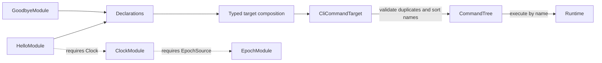

# CLI Contribution Prototype

This example tests one architecture boundary: application modules declare
commands at composition time, then a CLI-owned target validates and compiles
those declarations into the small `CommandTree` used at runtime. It is an
architecture prototype, not a production console package or a general process
composer.



Core defines stable contribution and target identities plus generic extension
contracts. Kernel associates each declaration with its contributor and
compile-time qualifier, and rejects required declarations when no matching
target is selected. The CLI target owns command-name conflicts, alphabetical
ordering, empty-tree behavior, and the runtime representation. Contributor
identities and declaration wrappers are absent from `CommandTree` after build.
Alphabetical order is this CLI target's policy only; it does not imply provider
cardinality or construction dependency order.

`PublicCommands` and `AdminCommands` are different Rust types. Their target
instances accept different declaration types, so a public command cannot be
passed to an admin target accidentally. This phase validates only the active
composition; deciding which declarations belong to a selected process is
deferred to Phase 4.

## Verified Behavior

| Case | Result |
| --- | --- |
| `hello` | Runs from the built tree and reads its injected Clock |
| `goodbye` | Runs from the same built tree without a Clock |
| Duplicate command names | Structured CLI error identifies target, name, and both contributors |
| Required declaration without target | Structured Kernel error includes target, contribution kind, qualifier, and contributors |
| Empty selected target | Builds a valid empty tree |
| Public vs. admin commands | Distinct declaration types and independent command trees |
| Third-party target | Builds through the same public Core and Kernel contracts |
| Assembly side effects | A test factory remains untouched until command execution needs its resource |

The Hello contributor requires `Clock`; `ClockModule` requires an
`EpochSource`. The tests validate both typed capability edges and the
construction dependency chain. Module construction remains application-owned;
target assembly never initializes those resources.

## Measurements

Measured on Rust 1.96.1, x86_64 Linux, AMD Ryzen 5 PRO 4650U. Build values use
three fresh-target release builds and immediate unchanged rebuilds. Assembly
uses nine samples of 100,000 two-command builds each.

| Metric | Result |
| --- | ---: |
| CLI target assembly, two commands | 86 ns median per build |
| Runtime tree storage | 96 B for the two-command tree, including its Vec capacity |
| Clean release build | 1.116 s median |
| Unchanged release rebuild | 61.84 ms median |
| Release executable | 4,367,280 B in all three runs |
| Process wall time | 1.736 ms median |
| Internal dependencies | 2: Core and Kernel; facade absent |

The benchmark does not instrument allocator calls. Inspection shows temporary
sorting storage and the final runtime `Vec`; the fixture also allocates the
input declaration vector per iteration. Process wall time includes process
launch, output, execution, and exit. These measurements have no previous
contribution-target baseline. Phase 2 examples are different programs, so their
build and runtime numbers are context only, not an overhead comparison. Raw
samples and environment are in
[`phase3-contribution-example.json`](../../docs/evidence/reports/phase3-contribution-example.json)
and the [Phase 3 evidence](../../docs/evidence/phase3.md).

Run the example from this repository:

```sh
cargo run --offline --locked --manifest-path examples/a3-contribution/Cargo.toml --example a3-contribution
cargo test --offline --locked --manifest-path examples/a3-contribution/Cargo.toml
cargo bench --offline --locked --manifest-path examples/a3-contribution/Cargo.toml --bench assembly
```

## What can I do now?

- [Process projection](../a4-process/README.md): select runnable processes from one blueprint
