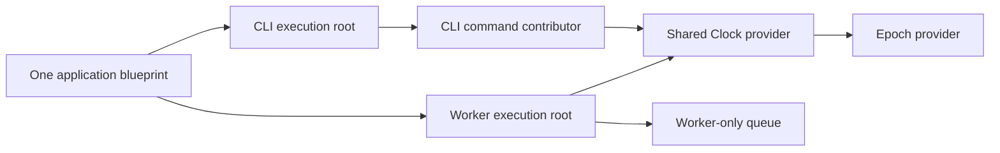

# Process Projection Prototype

One application blueprint describes two runnable projections. Selecting a
process starts from its execution roots and follows only the declared
capability-provider and consumed-target contribution links reachable from
those roots. A process here is an application execution boundary, not a claim
about an operating-system process.



The example shares Clock and its transitive Epoch provider. CLI reaches its
command contributor but not Worker or Queue. Worker reaches Queue but not the
CLI command. A dormant module has an intentionally undeclared database
provider; it does not block an unrelated CLI projection because it is
unreachable. Providers are resolved from declarations, with explicit selection,
replacement, and exclusion support. Reachable dependency cycles and required
orphan contributions produce structured projection errors.

Kernel returns each included module with an inclusion reason and a root-to-module
path. Worker requires `WORKER_CONCURRENCY` to be a positive integer. The setting
reader runs only after Worker is selected, so CLI starts without reading it even
when it is missing or invalid.

`inspect cli` prints the resolved identities, providers, contribution edges,
inclusion paths, and excluded-module reasons. The normal startup path freezes
the same projection first, then initializes only modules in its compact runtime
plan. A host test starts both projections together and checks their mutable
state is independent; this is in-memory isolation, not OS-process sharing.

## Run

From the `rustclamp` repository:

```sh
cargo run --offline --locked --manifest-path examples/a4-process/Cargo.toml --example a4-process -- cli
WORKER_CONCURRENCY=4 cargo run --offline --locked --manifest-path examples/a4-process/Cargo.toml --example a4-process -- worker
cargo run --offline --locked --manifest-path examples/a4-process/Cargo.toml --example a4-process -- inspect cli
cargo test --offline --locked --manifest-path examples/a4-process/Cargo.toml
```

To export both real process projections for the `clamp` inspection commands,
enable the optional tooling feature:

```sh
cargo run --offline --locked --manifest-path examples/a4-process/Cargo.toml \
  --example inspection-json --features tooling-inspection > architecture.json
cargo run --offline --locked --manifest-path tooling/Cargo.toml -- \
  tree architecture.json --process example.process.cli
```

## Runtime Selection vs Build Targets

`build-targets/` contrasts one binary that selects CLI or Worker at runtime
with feature-gated Cargo targets. The runtime-selected feature activates Core
and Kernel for either process; `cli-target` activates Core only; `worker-target`
activates Core and Kernel. Run `cargo tree --manifest-path
examples/a4-process/build-targets/Cargo.toml --no-default-features --features
cli-target` to inspect the CLI dependency graph. Runtime reachability therefore
does not prove compile-time or dependency stripping. The tiny binaries exercise
different amounts of behavior, so their size/build comparisons are illustrative,
not a causal framework-overhead claim. Full sample data and caveats are in the
[Phase 4 evidence](../../docs/evidence/phase4.md).

## What can I do now?

- [Lifecycle](../a5-lifecycle/README.md): start, drain and clean up resources
